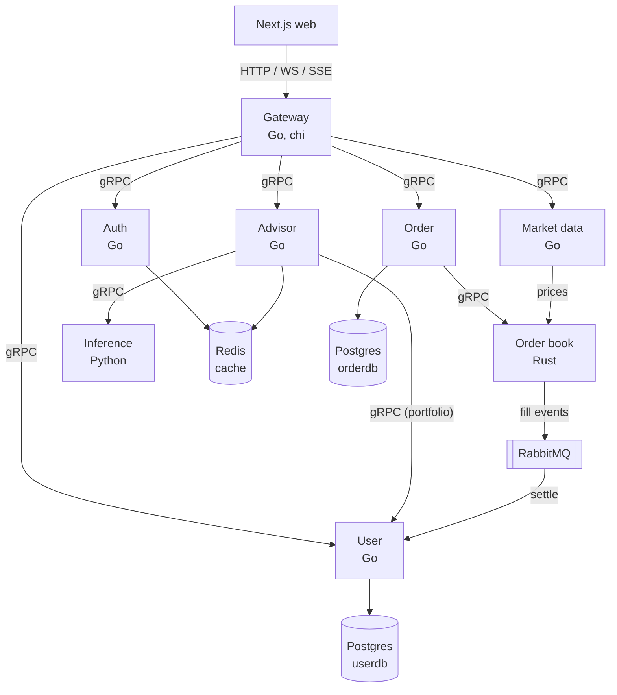

# Glyph

A paper-trading platform with a real matching engine and an LLM portfolio advisor.

Glyph runs a full microservice trading stack: a Next.js frontend talks to a single Go
gateway over HTTP and WebSocket, and the gateway fans out to backend services over gRPC.
Orders match against the live market price through a Rust matching engine, fills settle
asynchronously over RabbitMQ, and a local language model reviews your portfolio and
proposes strategies you can deploy.

## What it does

- **Paper trading** with a real order book. Orders reserve cash or shares, match against
  the live price (the same model Alpaca paper trading uses), and settle into positions.
- **Live market data** from Alpaca, streamed to the web app and injected into the order
  book so parked orders fill.
- **Strategies and backtests.** Build rule-based strategies (RSI, SMA, MACD, Bollinger,
  and more), backtest them over historical bars, and deploy them to trade automatically.
- **AI portfolio advisor.** A local language model reviews your allocation, flags
  concentration risk, and suggests next steps. It can also generate a deployable strategy
  tuned to your book.

## Architecture



The frontend talks only to the gateway; the gateway fans out to the services over gRPC.
Each service owns its data, and fills move between services asynchronously through
RabbitMQ. Prometheus and Grafana scrape every service for metrics.

A trade flows gateway -> order -> user (reserve) -> order book (match) -> RabbitMQ (fill)
-> user (settle). See [docs/architecture.md](docs/architecture.md) for the full picture.

### How the advisor works

The advisor is a thin Go service that assembles a text snapshot of your account (cash,
positions, P&L, concentration) and sends it to the inference service over gRPC. The
inference service is a Python process that hosts the model (default
`Qwen/Qwen2.5-1.5B-Instruct`, CPU only, swappable via `MODEL_ID`) and streams tokens back.

- **Analysis** streams to the portfolio page over SSE.
- **Snapshots are cached** in Redis and only regenerated when the portfolio changes
  materially (a scoring function on share and cash deltas, not price drift), so opening
  the page does not re-run the model every time.
- **Strategy generation** has the model pick from validated, deployable strategy templates
  and write a rationale, so the result always passes the strategy engine and can be
  backtested and deployed.

## Tech stack

- **Frontend:** Next.js, React, Tailwind, TanStack Query, lightweight-charts
- **Backend:** Go (chi, gRPC), Rust (matching engine), Python (model hosting via uv)
- **Contracts:** Protobuf with buf, generated for Go and Python
- **Data:** Postgres (sqlc, goose migrations), Redis
- **Messaging:** RabbitMQ
- **Infra:** Kubernetes, Tilt, Docker, Prometheus, Grafana

## Quickstart

Prerequisites: Go, Rust, Node and pnpm, Docker, a Kubernetes context (Docker Desktop is
fine), Tilt, and the build tools in [docs/tools.md](docs/tools.md) (buf, sqlc, goose).
You also need free Alpaca paper-trading keys for market data.

```bash
cp .env.example .env   # fill in Alpaca keys and secrets
tilt up                # builds images, applies k8s manifests, runs migrations
```

The web app comes up on [localhost:3000](http://localhost:3000) and the gateway on
[localhost:8080](http://localhost:8080). Full instructions, including running services by
hand, are in [docs/SETUP.md](docs/SETUP.md).

The first `tilt up` downloads the advisor model once into a persistent volume (the
inference init container), so the first start takes a few minutes; later starts are fast.

## Repo layout

```
proto/         protobuf contracts (one package per service)
services/      one directory per service
  auth/        sessions, JWT, OAuth
  user/        accounts, positions, strategies, backtests, strategy engine
  order/       order lifecycle and reservations
  order_book/  Rust matching engine
  mrktdata/    Alpaca market data
  advisor/     portfolio analysis and strategy generation
  inference/   Python model host
  gateway/     HTTP/WS/SSE edge, gRPC fan-out
  gen/         generated protobuf code (Go and Python)
web/           Next.js frontend
deployments/   Dockerfiles and Kubernetes manifests
docs/          architecture, setup, and per-service references
```

## Common commands

```bash
make proto         # regenerate protobuf code (Go and Python)
make build         # go build + cargo build
make test          # go test + cargo test
make lint          # go vet + cargo clippy
make web-test      # web unit tests
```

## Docs

- [Architecture](docs/architecture.md)
- [Setup](docs/SETUP.md)
- [Build tools](docs/tools.md)
- Per-service references under [docs/services](docs/services)
