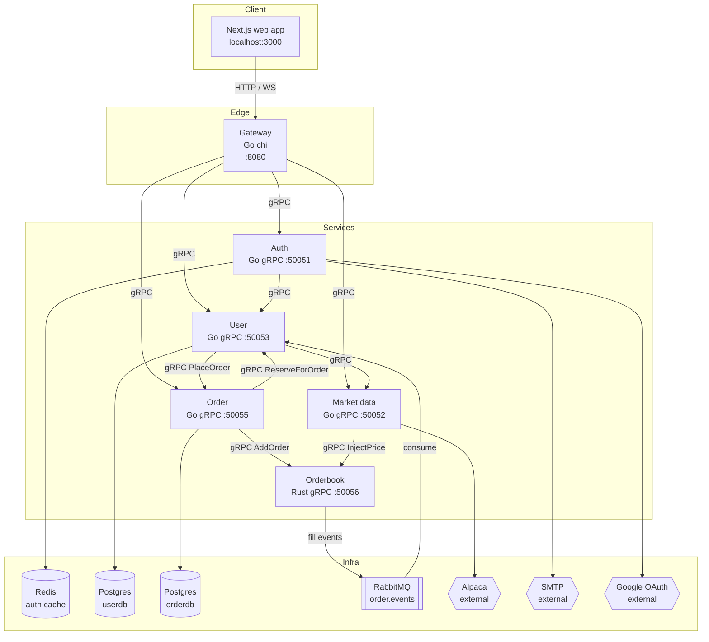

# Architecture

Glyph is a microservice trading platform. A Next.js frontend talks to a single Go
gateway over HTTP and WebSocket. The gateway fans out to the backend services over gRPC.
Each backend service owns its own data, and trade fills move between services
asynchronously through RabbitMQ.

## How a trade works

This is the core flow and the part worth understanding first.

1. You place an order in the web app. The gateway forwards it to the order service.
2. The order service asks the user service to reserve the cash (for a buy) or the shares
   (for a sell). If you cannot afford it, the order is rejected here.
3. The order service forwards the order to the orderbook (the Rust matching engine).
4. The orderbook fills orders against the latest market price, not against other users.
   This is the paper trading model: every fill is against a synthetic counterparty at the
   live price, the same way Alpaca paper trading fills against the market.
5. The orderbook publishes a fill event to RabbitMQ.
6. The user service consumes the fill event, updates your position and cash, and releases
   whatever was left of the reservation.

Market prices come from the market data service, which pulls them from Alpaca and injects
them into the orderbook so parked orders fill.

## Component diagram

## Tech stack

| Layer | Technology |
|-------|-----------|
| Frontend | Next.js (App Router), React, TanStack Query, Tailwind, motion, lightweight-charts |
| Gateway | Go, chi router, gorilla/websocket, golang-jwt |
| Services (Go) | gRPC, sqlc generated data access, zap logging |
| Matching engine | Rust, tonic gRPC, crossbeam-channel, tokio, lapin |
| Data stores | PostgreSQL (userdb, orderdb), Redis (auth cache and email queue) |
| Messaging | RabbitMQ (order.events direct exchange) |
| External | Alpaca, Google OAuth, SMTP |
| Build and deploy | Docker, Kubernetes, Tilt, buf for proto codegen |

## Port map

| Service | Port | Set by |
|---------|------|--------|
| Web | 3000 | next dev server |
| Gateway | 8080 | `GATEWAY_PORT` |
| Auth | 50051 | `AUTH_SVC_PORT` |
| Market data | 50052 | `MRKTDATA_SVC_PORT` |
| User | 50053 | `USER_SVC_PORT` |
| Order | 50055 | `ORDER_SVC_PORT` |
| Orderbook | 50056 | `SERVER_PORT` |

## Conventions

- All money is integer cents. Quantities are integers too.
- Each proto file owns one service contract. The Go stubs are generated with buf and
  committed under `services/gen/golang/`. The Rust stubs are generated at build time by
  the orderbook's `build.rs`.
- Each Go service that uses Postgres keeps its schema in `services/<svc>/db/schema.sql`,
  its queries in `db/queries/`, and the generated code in `db/gen/`. Migrations live in
  `db/migrations/` and run with goose.
- Services degrade rather than crash when an optional dependency is missing. No RabbitMQ
  means no settlement, but the rest still runs. No market data client means holdings fall
  back to cost basis.

## Observability

Every Go service exposes Prometheus metrics on its own metrics port through the shared
`pkg/telemetry` package. gRPC requests are timed by an interceptor, and the services bump
product metrics (orders placed, fills, and so on) on their hot paths. The shared
`pkg/logger` package gives every service structured zap logging with request and user id
fields pulled from context.
