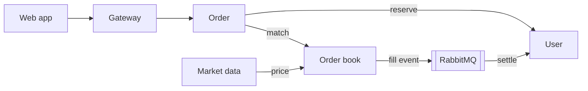
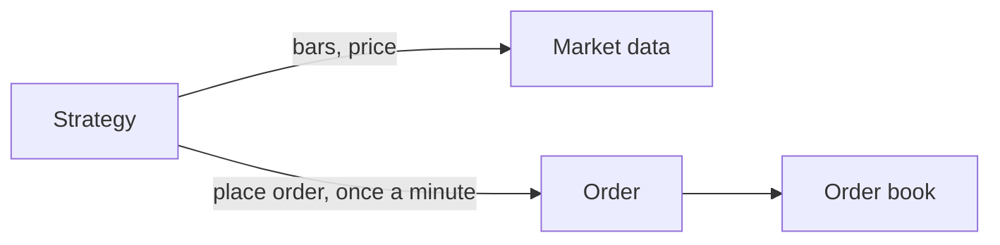
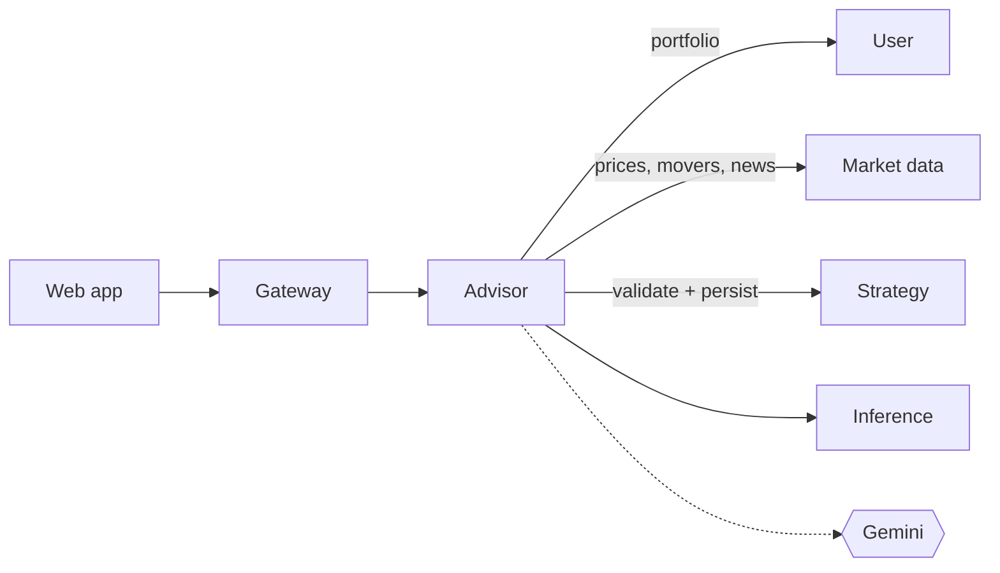
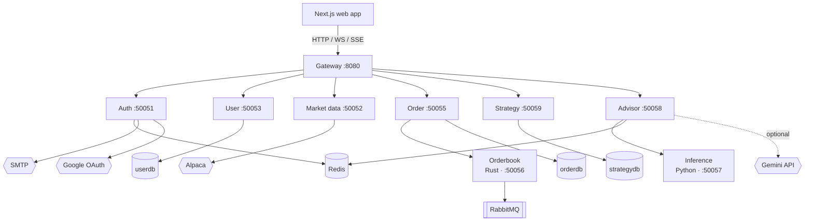

# Architecture

Glyph is a microservice trading platform. A Next.js frontend talks to a single Go
gateway over HTTP, WebSocket, and SSE. The gateway fans out to the backend services over
gRPC. Each backend service owns its own data, and trade fills move between services
asynchronously through RabbitMQ.

## How a trade works

This is the core flow and the part worth understanding first.

1. You place an order in the web app. The gateway forwards it to the order service.
2. The order service asks the user service to reserve the cash (for a buy) or the shares
   (for a sell). If you cannot afford it, the order is rejected here.
3. The order service forwards the order to the orderbook (the Rust matching engine).
4. The orderbook fills orders against the latest market price, not against other users.
   This is the paper trading model: every fill is against a synthetic counterparty at the
   live price, the same way Alpaca paper trading fills against the market.
5. The orderbook publishes a fill event to RabbitMQ.
6. The user service consumes the fill event, updates your position and cash, and releases
   whatever was left of the reservation.

Market prices come from the market data service, which pulls them from Alpaca and injects
them into the orderbook so parked orders fill.

## How a deployed strategy trades

A strategy is a JSON config of indicators, entry/exit rules, a stop-loss, and a
take-profit, owned by the strategy service, not the user service. Deploying one starts
the same flow as a manual order, just triggered on a timer instead of a click:

1. The strategy engine ticks once a minute during market hours and pulls every running
   deployment from Postgres.
2. For each deployment it fetches recent bars and the latest price from the market data
   service and evaluates the entry or exit rules against them.
3. On an entry signal (and not already in position) it calls the order service's
   `PlaceOrder` with a buy; on an exit signal it places a sell. From there it's the same
   reserve -> match -> settle path as any other order.
4. The deployment record tracks `in_position`, entry price, and quantity so the next tick
   knows whether it's looking for an entry or an exit.

Backtests run the identical engine over historical bars instead of live ticks, so a
backtest and a live deployment evaluate rules the same way.

## How the chat agent works

The advisor service (branded "Kenaz" in the UI) runs a tool-calling agent loop, not a
single prompt:

1. The gateway proxies `POST /advisor/chat` to the advisor's `ChatWithAdvisor` RPC, which
   streams the response back as SSE.
2. A topic gate rejects anything that isn't about markets, strategies, or your account
   before it reaches the model.
3. The model can call `get_portfolio`, `get_price`, `get_market`, `get_news`, or
   `generate_strategy` to gather information before answering.
4. Turn history and in-flight state persist in Redis per user, so a refresh doesn't lose
   the conversation, and a Redis lock keeps a second message from processing while one is
   already in flight.
5. Each request picks a provider: the local inference service, or Gemini as a hosted
   alternative. Strategy generation falls back to the default provider if the requested
   one fails.

Strategy generation is asynchronous: `StartStrategyGeneration` returns a job immediately,
and a background goroutine prompts the model, parses the resulting JSON strategy (retrying
once with the validation error on a parse failure), backtests it through the strategy
service, and only persists it if the backtest produced at least one trade. The web app
polls `GetStrategyJob` for the result.

## Cascade deletes

When an account is deleted, the user service publishes a `user.deleted` event to
RabbitMQ. The strategy service consumes it and deletes every strategy and deployment for
that user in one transaction, so deleting an account doesn't leave orphaned strategies
behind.

## Service topology

Every service, its port, and what it depends on directly. See the flows above for how
they actually talk to each other mid-request.

## Tech stack

| Layer | Technology |
|-------|-----------|
| Frontend | Next.js (App Router), React, TanStack Query, Tailwind, motion, lightweight-charts |
| Gateway | Go, chi router, gorilla/websocket, golang-jwt |
| Services (Go) | gRPC, sqlc generated data access, zap logging |
| Matching engine | Rust, tonic gRPC, crossbeam-channel, tokio, lapin |
| Inference | Python, grpcio, transformers, uv |
| Data stores | PostgreSQL (userdb, orderdb, strategydb), Redis (auth cache, email queue, chat sessions) |
| Messaging | RabbitMQ (`order.events` direct exchange, `user.deleted` for cascade deletes) |
| External | Alpaca, Google OAuth, SMTP, Gemini API |
| Build and deploy | Docker, Kubernetes, Tilt, buf for proto codegen |

## Port map

| Service | Port | Set by |
|---------|------|--------|
| Web | 3000 | next dev server |
| Gateway | 8080 | `GATEWAY_PORT` |
| Auth | 50051 | `AUTH_SVC_PORT` |
| Market data | 50052 | `MRKTDATA_SVC_PORT` |
| User | 50053 | `USER_SVC_PORT` |
| Order | 50055 | `ORDER_SVC_PORT` |
| Orderbook | 50056 | `SERVER_PORT` |
| Inference | 50057 | `INFERENCE_BIND` |
| Advisor | 50058 | `ADVISOR_SVC_PORT` |
| Strategy | 50059 | `STRATEGY_SVC_PORT` |

## Conventions

- All money is integer cents. Quantities are integers too.
- Each proto file owns one service contract. The Go stubs are generated with buf and
  committed under `services/gen/golang/`. The Rust stubs are generated at build time by
  the orderbook's `build.rs`. The Python stubs for the inference service are generated by
  buf's Python plugins.
- Each Go service that uses Postgres keeps its schema in `services/<svc>/db/schema.sql`,
  its queries in `db/queries/`, and the generated code in `db/gen/`. Migrations live in
  `db/migrations/` and run with goose. Strategy is the newest service to follow this and
  gets its own `strategydb`, separate from `userdb` and `orderdb`.
- Services degrade rather than crash when an optional dependency is missing. No RabbitMQ
  means no settlement and no cascade deletes, but the rest still runs. No market data
  client means holdings fall back to cost basis. No `MODEL_ID` means the inference service
  falls back to an echo responder instead of loading a model.

## Observability

Every Go service exposes Prometheus metrics on its own metrics port through the shared
`pkg/telemetry` package. gRPC requests are timed by an interceptor, and the services bump
product metrics (orders placed, fills, chat turns, and so on) on their hot paths. The
shared `pkg/logger` package gives every service structured zap logging with request and
user id fields pulled from context.
